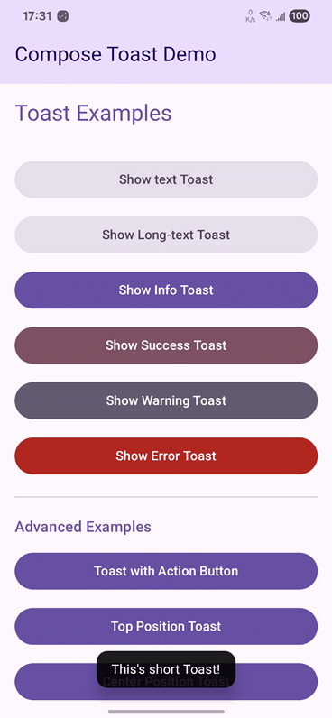

# Compose Toast

[English](README.md) | 简体中文

[](https://jitpack.io/#ocnyang/ComposeToast)
![badge][badge-android]
![badge][badge-ios]
![badge][badge-js]
![badge][badge-wasm]
![badge][badge-jvm]

一个漂亮、可定制的 Toast 库，支持 Kotlin 多平台 Compose，适用于 Android、iOS、Desktop、Web 和 WASM。



## 在线演示

**[在线体验 Web 版](https://ocnyang.github.io/ComposeToast/)**

直接在浏览器中体验所有 Toast 功能！

## 特性

- ✅ **Kotlin 多平台** - 支持 Android、iOS、Desktop、Web 和 WASM
- 🎨 **完全可定制** - 自定义颜色、图标和布局
- 📍 **多种位置** - 顶部、居中、底部
- ⚡ **操作按钮** - 为 Toast 添加交互式操作按钮
- 🔄 **队列管理** - 自动队列管理，平滑过渡
- 🎭 **内置类型** - Success、Error、Warning、Info，带有默认样式
- 🪟 **对话框支持** - 在所有平台的对话框中正确显示
- 🎯 **类型安全 API** - Kotlin 优先的 API，带有默认参数

## 安装

### 步骤 1：添加 JitPack 仓库

在项目根目录的 `build.gradle.kts` 的 repositories 末尾添加：

```kotlin
allprojects {
    repositories {
        maven { url = uri("https://jitpack.io") }
    }
}
```

或者在 `settings.gradle.kts` 中添加：

```kotlin
dependencyResolutionManagement {
    repositories {
        maven { url = uri("https://jitpack.io") }
    }
}
```

### 步骤 2：添加依赖

在模块的 `build.gradle.kts` 中：

```kotlin
kotlin {
    sourceSets {
        commonMain {
            dependencies {
                implementation("com.github.OCNYang.ComposeToast:toast:1.0.0")
            }
        }
    }
}
```

将 `ocnyang` 替换为你实际的 GitHub 用户名，将 `1.0.0` 替换为所需的版本或标签。

## 快速开始

### 1. 在应用根部设置 ToastManager

```kotlin
@Composable
fun App() {
    MaterialTheme {
        ProvideToastManager {
            YourAppContent()
        }
    }
}
```

### 2. 在任何地方显示 Toast

```kotlin
// 成功 Toast
Toast.showSuccess("操作完成！")

// 错误 Toast
Toast.showError("出错了！")

// 警告 Toast
Toast.showWarning("请检查你的输入")

// 信息 Toast
Toast.showInfo("正在处理你的请求...")

// 自定义 Toast
Toast.show(
    message = "自定义消息",
    imageVector = Icons.Default.Star,
    backgroundColor = Color.Blue,
    textColor = Color.White,
    duration = 3000L,
    position = ToastPosition.TOP
)
```

## 使用示例

### 带操作按钮的 Toast

```kotlin
Toast.show(
    message = "商品已从购物车中删除",
    actions = arrayOf(
        ActionData("撤销") {
            Toast.showSuccess("已撤销操作！")
        }
    )
)
```

### 自定义位置

```kotlin
// 顶部位置
Toast.show("顶部消息", position = ToastPosition.TOP)

// 居中位置
Toast.show("居中消息", position = ToastPosition.CENTER)

// 底部位置（默认）
Toast.show("底部消息", position = ToastPosition.BOTTOM)
```

### 自定义持续时间

```kotlin
Toast.show(
    message = "这条消息显示 6 秒",
    duration = 6000L
)
```

### 在对话框中使用

在对话框中正确显示 Toast（特别是在 Android/iOS 上）：

```kotlin
var showDialog by remember { mutableStateOf(false) }

WithToastComposable(show = showDialog) { toastManager ->
    AlertDialog(
        onDismissRequest = { showDialog = false },
        title = { Text("对话框示例") },
        text = {
            DialogToastContent(toastManager = toastManager) {
                Text("点击按钮显示 Toast！")
            }
        },
        confirmButton = {
            Button(onClick = {
                toastManager.showSuccess("来自对话框的 Toast！")
            }) {
                Text("显示 Toast")
            }
        }
    )
}
```

### 自定义 Toast 布局

你可以提供完全自定义的 Toast 布局：

```kotlin
ProvideToastManager(
    toastContent = { toastData, maxWidth, onDismiss ->
        CustomToastContent(toastData, maxWidth, onDismiss)
    }
) {
    YourAppContent()
}
```

### 直接使用 ToastManager

```kotlin
@Composable
fun MyScreen() {
    val toastManager = rememberToastManager()

    Button(onClick = {
        toastManager.showSuccess("点击了！")
    }) {
        Text("点我")
    }
}
```

## API 参考

### Toast（全局对象）

- `Toast.show()` - 显示自定义 Toast
- `Toast.showSuccess()` - 显示成功 Toast
- `Toast.showError()` - 显示错误 Toast
- `Toast.showWarning()` - 显示警告 Toast
- `Toast.showInfo()` - 显示信息 Toast
- `Toast.clear()` - 清除所有 Toast

### ToastManager（实例）

当需要更多控制或在对话框中使用时：

- `toastManager.showToast()` - 显示自定义 Toast
- `toastManager.showSuccess()` - 显示成功 Toast
- `toastManager.showError()` - 显示错误 Toast
- `toastManager.showWarning()` - 显示警告 Toast
- `toastManager.showInfo()` - 显示信息 Toast
- `toastManager.dismissCurrent()` - 关闭当前 Toast
- `toastManager.clear()` - 清除所有 Toast

### 组件

- `ProvideToastManager` - 在应用根部设置 Toast 管理器
- `WithToastComposable` - 为对话框提供独立的 Toast 管理器
- `DialogToastContent` - 对话框内容包装器，支持 Toast
- `rememberToastManager` - 获取当前 Toast 管理器实例

## 平台支持

| 平台      | 支持 |
|---------|------|
| Android | ✅   |
| iOS     | ✅   |
| Desktop | ✅   |
| Web (JS)| ✅   |
| WASM    | ✅   |

## 许可证

MIT License - 详见 [LICENSE](LICENSE) 文件

## 贡献

欢迎贡献！请随时提交 Pull Request。

---

[badge-android]: http://img.shields.io/badge/-android-6EDB8D.svg?style=flat
[badge-jvm]: http://img.shields.io/badge/-jvm-DB413D.svg?style=flat
[badge-js]: http://img.shields.io/badge/-js-F8DB5D.svg?style=flat
[badge-wasm]: https://img.shields.io/badge/-wasm-624FE8.svg?style=flat
[badge-ios]: http://img.shields.io/badge/-ios-CDCDCD.svg?style=flat
